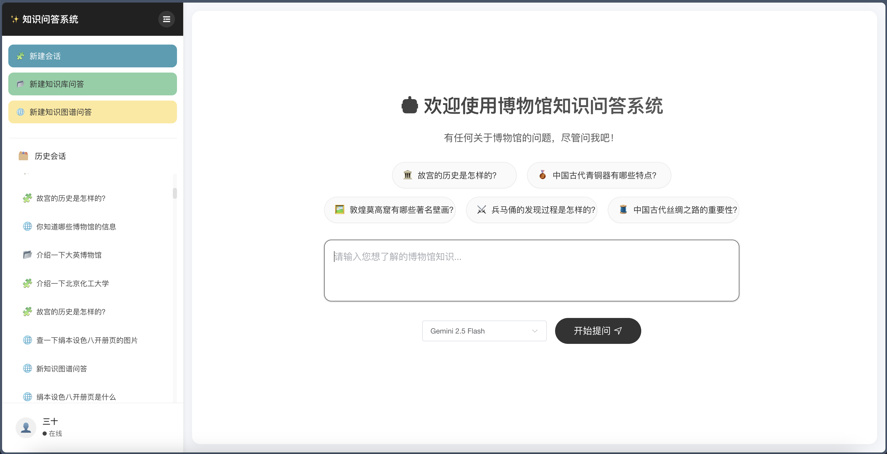
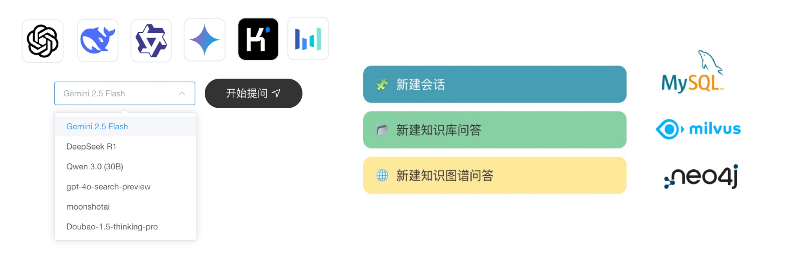

# 👾 KnowledgeQuery — 知识问答子系统



## 🚀 项目介绍 (Project Overview)

KnowledgeQuery 是一个融合多模式的博物馆智能问答助手，旨在运用前沿人工智能技术，为博物馆参观者及研究人员提供一个高效、精准、友好的知识获取与智能交互平台。本系统成功实现了基础聊天、知识库问答 (RAG) 和知识图谱问答三种核心模式，以满足不同场景下的用户需求，并支持流畅的实时交互体验。



## ✨ 核心功能 (Core Features)
- [x] 🧩 基础聊天模式
    *   与多种大语言模型直接进行开放式闲聊。
    *   支持上下文理解和多轮交互，提供连贯的对话体验。
    *   答案实时流式生成并逐步展示，支持 Markdown 格式化输出。
    *   后端采用并发处理能力，避免请求阻塞。

- [x] 📂  知识库问答
    *   基于用户上传的私有文档（如 PDF, TXT, DOC）进行精准问答。
    *   通过检索相关文本片段作为 LLM 的上下文，有效减少幻觉，使回答更忠实于原文。
    *   采用 Milvus 向量数据库和 HNSW 索引进行高效相似度检索。

- [x] 🌐 知识图谱问答
    *   利用构建的博物馆知识图谱（包含 17000+ 展品信息）进行深度查询与智能推理。
    *   将自然语言问题转换为 Cypher 查询语句，实现图谱的精准检索。
    *   结合图谱查询结果和 LLM 的理解能力，生成结构化、信息丰富的答案。

## 🛠️ 技术栈 (Technical Stack)

*   **前端 (Frontend)**: `Vue 3` - 构建现代化、响应式的用户交互界面。
*   **后端 (Backend)**: `FastAPI (Python)` - 提供高性能、异步的 API 服务，支持快速迭代。
*   **关系型数据库 (Relational Database)**: `MySQL` - 存储用户数据、会话历史等结构化信息。
*   **向量数据库 (Vector Database)**: `Milvus` - 高效存储与检索文本向量，支撑 RAG 功能。
*   **图数据库 (Graph Database)**: `Neo4j` - 构建和查询知识图谱，实现复杂关系分析。

## ⚙️ 快速开始 (Getting Started)

### 📦 后端启动 (Backend Setup)

1.  **克隆项目仓库 (Clone the repository):**
    ```bash
    git clone https://github.com/BUCT-CS2201/KnowledgeQuery.git
    cd KnowledgeQuery
    ```

2.  **进入后端目录 (Navigate to the backend directory):**
    ```bash
    cd backend
    ```

3.  **创建并激活虚拟环境 (Create and activate a virtual environment):**
    ```bash
    python3 -m venv venv
    # Linux/macOS
    source venv/bin/activate
    # Windows (Command Prompt)
    venv\Scripts\activate
    # Windows (PowerShell)
    .\venv\Scripts\Activate.ps1
    ```

4.  **安装依赖 (Install dependencies):**
    ```bash
    pip install --upgrade pip
    pip install -r requirements.txt
    ```

5.  **配置 `.env` 文件 (Configure the `.env` file):**
    复制 `.env_copy` 文件并重命名为 `.env`：
    ```bash
    cp .env_copy .env
    ```
    然后使用文本编辑器（如 `vim` 或 `nano`）打开 `.env` 文件，根据您的环境配置以下变量：
    ```ini
    # 数据库配置 (Database Configuration)
    # 请确保MySQL、Milvus、Neo4j服务正在运行，并填写正确的连接信息
    MYSQL_IP=localhost
    MYSQL_PORT=3306
    MYSQL_BASE=knowledge_query_db # 您的数据库名称
    MYSQL_USER=root
    MYSQL_PASSWORD=your_mysql_password
    
    # JWT设置 (JWT Settings)
    SECRET_KEY=your_very_secret_key_for_jwt_signing # 请替换为随机且足够复杂的密钥
    
    # 大模型API配置 (LLM API Configuration)
    # 访问 AIHubMix 获取 API Key 和 Base URL
    AIHUBMIX_API_KEY=your_aihubmix_api_key
    AIHUBMIX_BASE_URL=https://api.aihubmix.com/v1
    AIHUBMIX_MODEL=gemini-2.5-flash-preview-04-17 # 默认模型，可在前端切换
    
    # Milvus配置 (Milvus Configuration)
    MILVUS_HOST=localhost
    MILVUS_PORT=19530
    MILVUS_DATABASE=default # 默认数据库
    MILVUS_COLLECTION=museum_knowledge # 知识库集合名称
    
    # Neo4j配置 (Neo4j Configuration)
    NEO4J_URI=bolt://localhost:7687
    NEO4J_USERNAME=neo4j
    NEO4J_PASSWORD=your_neo4j_password # 您的Neo4j密码
    NEO4J_MAX_CONNECTION_LIFETIME=300 # 连接生命周期 (秒)
    NEO4J_MAX_CONNECTION_POOL_SIZE=100 # 连接池大小
    NEO4J_CONNECTION_TIMEOUT=10 # 连接超时 (秒)
    ```

6.  **运行后端服务 (Run the backend service):**
    ```bash
    uvicorn main:app --reload --port 9988
    ```
    后端服务将在 `http://localhost:9988` 运行。

### 💻 前端部署 (Frontend Setup)

1.  **进入前端目录 (Navigate to the frontend directory):**
    ```bash
    cd frontend
    ```

2.  **安装依赖 (Install dependencies):**
    ```bash
    npm install
    ```
    **如果安装依赖时遇到问题，可以尝试以下步骤：**
    *   **检查 Node.js 和 npm 版本:** 确保它们符合项目要求 (推荐 Node.js v20+)。
        ```bash
        node --version
        npm --version
        ```
    *   **切换 npm 源 (Optional):** 如果下载速度慢或报错，可以尝试切换到国内镜像源：
        ```bash
        npm config set registry https://registry.npmmirror.com/
        npm install # 重新安装
        ```
    *   **清理缓存并重新安装 (Clean cache and reinstall):**
        *   **Windows PowerShell:**
            ```powershell
            Remove-Item -Recurse -Force node_modules
            Remove-Item package-lock.json
            npm cache clean --force
            npm install
            ```
        *   **Windows Command Prompt:**
            ```cmd
            rd /s /q node_modules
            del package-lock.json
            npm cache clean --force
            npm install
            ```
        *   **Linux/macOS:**
            ```bash
            rm -rf node_modules
            rm package-lock.json
            npm cache clean --force
            npm install
            ```

3.  **运行前端开发服务器 (Run the frontend development server):**
    ```bash
    npm run dev
    ```
    前端应用通常会在 `http://localhost:5173` 或类似端口启动。

